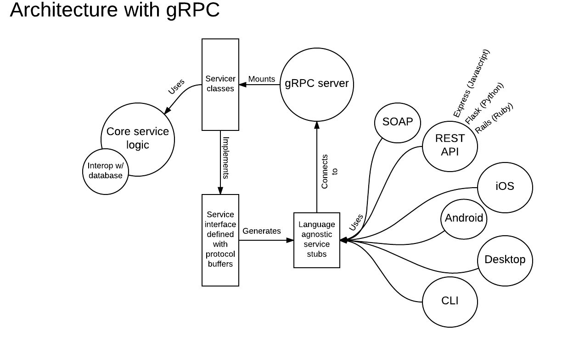

# grpc_python_example

Demos the following:

* a simple service that can return an `Item` from Postgres database using SQLAlchemy as an ORM, and Alembic for migrations
* the following APIs to access the service:
    * grpc
    * RESTful, [JSON-API compliant](http://jsonapi.org/format/) API using Flask
    * text API with CLI using Click
* example Dockerfile and docker-compose.yml file that dockerizes the service and its apis

## Table of Contents

* [Description](#description)
* [Contributing](docs/CONTRIBUTING.md)
* [Todo](docs/TODO.md)
* [License](docs/LICENSE.md)

## Description

(AFAIK)

### Pros

#### gRPC server

- Fast! Uses HTTP 2 and encodes requests in binary format

#### Language agnostic stubs

- Don't have to reimplement same client in multiple languages
- Stubs are just plain old objects/modules so don't have to worry about it not working with one framework or another
- Just have to generate stub from protobuf definitions in an e.g. organization level `.proto` repository

### Cons

- Documentation is lacking
- Few established best practices, conventions, code snippets etc.
